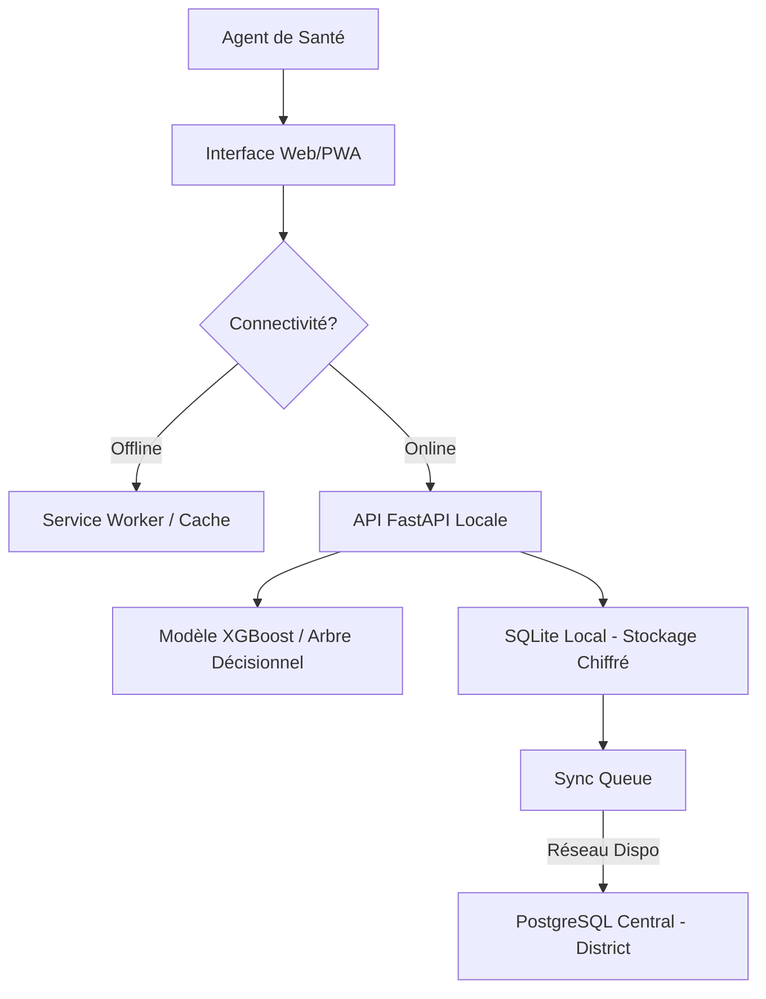

# Feuille de Route : Transformation HealthGuard IA en Web App + PWA

Ce document détaille la stratégie et les étapes techniques pour transformer le prototype actuel en une application web progressive (PWA) fonctionnelle, installable et capable de fonctionner en mode hors-ligne.

## 1. Analyse de l'existant
L'architecture actuelle est déjà très proche d'une application de production :
- **Backend :** FastAPI (Python) gère déjà le diagnostic (XGBoost), le chiffrement (AES) et la synchronisation PostgreSQL.
- **Frontend :** Interface HTML5/CSS3/JS modulaire, déjà responsive et gérant les états de connectivité.
- **Données :** Utilisation de SQLite en local et PostgreSQL pour le cloud.

## 2. Objectifs de la Transformation
1.  **Installabilité :** Permettre aux agents de santé d'ajouter l'icône sur leur écran d'accueil (Android/iOS/PC).
2.  **Mode Offline Avancé :** Charger l'interface instantanément même sans réseau grâce au Service Worker.
3.  **Interactivité Réelle :** Remplacer les simulations par des appels réels au moteur IA.
4.  **Expérience Native :** Masquer les barres de navigation du navigateur pour un look "App".

## 3. Étapes de Mise en Œuvre

### Étape A : Création du Manifest PWA
Ajouter un fichier `manifest.json` à la racine du dossier `prototype/`. Ce fichier définit le nom, les icônes et les couleurs de l'application.

### Étape B : Mise en place du Service Worker
Création de `sw.js` pour gérer le cache.
- **Stratégie :** "Cache First, then Network" pour les fichiers statiques (CSS, JS, Images).
- **Stratégie :** "Network First" pour les appels API (diagnostic, sync).

### Étape C : Adaptation du Backend (FastAPI)
Modifier `src/api/app.py` pour :
- Servir les fichiers statiques correctement.
- Gérer les headers de sécurité pour le Service Worker.
- Ajouter un endpoint pour tester la connexion au serveur central.

### Étape D : Intégration Dynamique du Frontend
Dans les fichiers JS (comme `nav.js` ou des scripts spécifiques aux écrans) :
- Remplacer les données "mockées" (simulées) par des requêtes `fetch()` vers l'API.
- Implémenter le stockage temporaire des diagnostics dans `IndexedDB` si l'API locale est injoignable.

## 4. Architecture de l'Application Finale

## 5. Guide d'Installation (Futur)
1. Ouvrir l'URL du projet dans Chrome ou Safari.
2. Cliquer sur "Ajouter à l'écran d'accueil".
3. L'application se lance en plein écran, sans barre d'adresse.

---
*Document rédigé le 27 avril 2026 pour le projet HealthGuard IA.*
